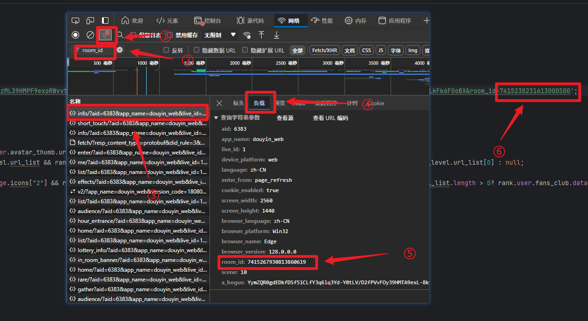

<div style="text-align: center">
  <p align="center">
  
      <br>
      <i>可以查看直播间神秘人真实主页信息，揭秘神秘人的真面目。</i>
  </p>
</div>


## 效果展示


## 使用

### 配置
进入一个直播间，按F12打开控制台，找到network，然后刷新一下，通过`room_id`过滤一下数据，过滤出来后随便点一条数据，然后点击负载，找到`room_id`复制，打开index.js找到url把最后的`room_id`替换掉就可以了

### 运行
```bash
# 环境安装
npm install
#项目启动
node index.js
```

## 声明：本代码库所有代码均只用于学习研究交流，严禁用于包括但不限于商业谋利、破坏系统、盗取个人信息等不良不法行为，违反此声明使用所产生的一切后果均由违反声明使用者承担。
## 侵权或涉及相关利益请联系作者：[邮箱](mailto:2359824360@qq.com)